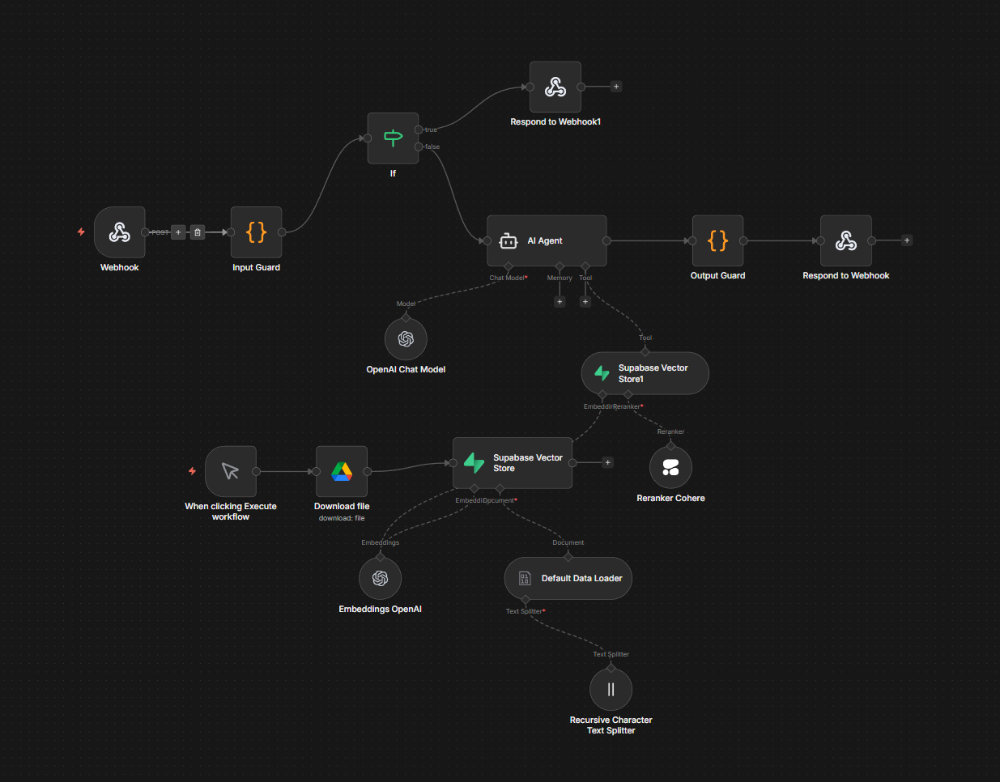

[yasinharman.dev](https://yasinharman.dev)

# Yasin AI Portfolio — Kişisel Asistan

Yasin Harman'ın kişisel portfolyo sitesinin **AI destekli** bir landing page şablonudur. Ziyaretçiler, klasik "hakkımda / projelerim" sayfalarında gezinmek yerine doğrudan **Jarvis** adında bir yapay zekâ asistanına soru sorarak Yasin hakkında bilgi alır.

Proje; React + Vite tabanlı bir arayüz ile n8n üzerinde çalışan bir LLM workflow'unu webhook üzerinden birbirine bağlar.

## Öne Çıkan Özellikler

- **Konuşmaya dayalı hero section** — Kullanıcı, arama çubuğuna "Yasin hangi teknolojileri kullanıyor?" gibi sorular yazar; daktilo efektiyle değişen placeholder'lar ilham verir.
- **Jarvis AI asistanı** — Mesajlar n8n webhook'una POST edilir, dönen yanıt (response / output / text / message alanlarından hangisi gelirse) sohbet arayüzünde render edilir.
- **Canlı sohbet arayüzü** — İlk mesaj gönderildiğinde `ChatInterface` bileşeni açılır ve sayfa yumuşak biçimde oraya kayar. Satır sonları (`\n`) doğru şekilde işlenir.
- **Animasyonlu WebGL arka plan** — `unicornstudio-react` ile oluşturulan Aura efekti `React.lazy` ile tembel yüklenir.
- **Düşük güçlü cihaz algılama** — `useIsLowPowerDevice` hook'u zayıf donanımlarda WebGL sahnesi yerine statik bir radial-gradient arka plana düşer.
- **Tasarım** — TailwindCSS, Bricolage Grotesque fontu, turuncu/amber gradyanlar ve Iconify ikon seti.

## Teknoloji Yığını

- **Framework:** React 18 + Vite 5
- **Routing:** react-router-dom
- **Stil:** TailwindCSS, clsx, tailwind-merge
- **Görsel:** unicornstudio-react (WebGL), iconify-icon
- **Backend:** n8n workflow (webhook üzerinden)

## Proje Yapısı

```
src/
├── App.jsx                      # Üst seviye state + webhook entegrasyonu
├── main.jsx                     # React root
├── components/
│   ├── Header.jsx
│   ├── Hero.jsx                 # Başlık + AI arama kutusu
│   └── ChatInterface.jsx        # Sohbet görünümü
└── hooks/
    ├── useTypewriter.js         # Placeholder yazı animasyonu
    └── useIsLowPowerDevice.js   # Donanım algılama
```

## Kurulum

```bash
git clone <repo-url>
cd AI-Assistant-Portfolio-Landing-Page-Template
npm install
```

Kök dizine bir `.env` dosyası ekleyin:

```
VITE_N8N_WEBHOOK_URL=https://<n8n-adresiniz>/webhook/<id>
```

## Scriptler

| Komut             | Açıklama                              |
| ----------------- | ------------------------------------- |
| `npm run dev`     | Geliştirme sunucusunu başlatır        |
| `npm run build`   | Üretim için derler                    |
| `npm run preview` | Build çıktısını yerelde önizler       |
| `npm run lint`    | ESLint ile kod kalitesini kontrol eder|

## n8n Workflow



Workflow iki paralel akıştan oluşur:

**1. Sohbet akışı (gerçek zamanlı)**
`Webhook → AI Agent → Respond to Webhook`
AI Agent şu bileşenlerle beslenir:
- **OpenAI Chat Model** — yanıt üretimi
- **Supabase Vector Store** — tool olarak bağlanır; Yasin hakkındaki bilgileri semantic search ile getirir
- **Reranker Cohere** — vector store sonuçlarını alaka düzeyine göre yeniden sıralar

**2. İçerik besleme akışı (manuel tetikli)**
`Execute → Google Drive (Download file) → Default Data Loader → Recursive Character Text Splitter → Embeddings OpenAI → Supabase Vector Store`
Yasin hakkındaki kaynak dokümanlar Google Drive'dan indirilir, parçalara ayrılır, OpenAI embedding'leri ile vektörleştirilir ve Supabase'e yazılır.

### Webhook Sözleşmesi

İstek (frontend → n8n):

```json
{ "message": "Yasin hangi projelerde çalıştı?" }
```

Yanıt (n8n → frontend) aşağıdaki alanlardan herhangi biri olabilir: `response`, `output`, `text`, `message`, `reply`, `answer` veya doğrudan `string`. Dizi dönerse ilk eleman kullanılır.

## Lisans

Kişisel portfolyo projesidir. Şablon olarak kullanmak isteyenler serbestçe fork'layabilir.
