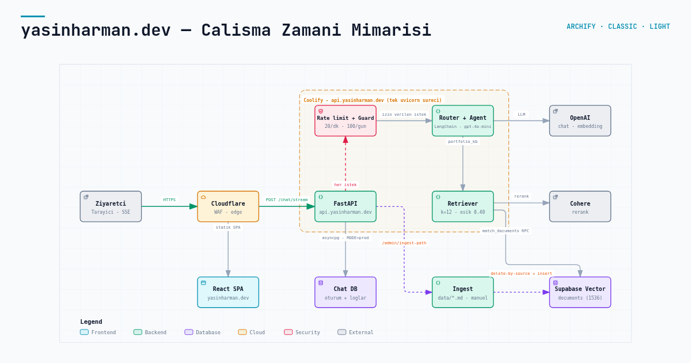

[yasinharman.dev](https://yasinharman.dev)

# Yasin AI Portfolio — Kişisel Asistan

Yasin Harman'ın kişisel portfolyo sitesinin **AI destekli** bir landing page şablonudur. Ziyaretçiler, klasik "hakkımda / projelerim" sayfalarında gezinmek yerine doğrudan **Jarvis** adında bir yapay zekâ asistanına soru sorarak Yasin hakkında bilgi alır.

Proje; React + Vite tabanlı bir arayüz ile FastAPI + LangChain tabanlı bir RAG servisini HTTP üzerinden birbirine bağlar. Sistemin genel resmi için [`docs/architecture.md`](docs/architecture.md).

## Mimari

<p align="center">
  <picture>
    <source media="(prefers-color-scheme: dark)" srcset="docs/assets/mimari-dark.png">
    
  </picture>
</p>

Ziyaretçinin sorusu Cloudflare'dan geçip tek bir uvicorn sürecine giriyor; orada
rate limit ve guard'lardan sonra router kapsam kararını veriyor, `career` dışı
sorular retrieval'a ve ana LLM'e hiç ulaşmıyor. Bilgi tabanı Supabase vector
store'da, oturum hafızası ve loglar ayrı bir Postgres'te duruyor.

**[Etkileşimli sürüm: `docs/mimari.html`](docs/mimari.html)** — düğüm arama (`/`),
rota izleme (`R`), rehberli anlatım (`P`), koyu/açık tema. Tek dosya, bağımlılıksız;
tarayıcıda açmak yeterli. Kaynağı [`docs/mimari.architecture.json`](docs/mimari.architecture.json)
([Archify](https://github.com/tt-a1i/archify) ile derlenir). Anlatımın tamamı için
[`docs/architecture.md`](docs/architecture.md).

## Öne Çıkan Özellikler

- **Konuşmaya dayalı hero section** — Kullanıcı, arama çubuğuna "Yasin hangi teknolojileri kullanıyor?" gibi sorular yazar; daktilo efektiyle değişen placeholder'lar ilham verir.
- **Jarvis AI asistanı** — Mesajlar FastAPI `/chat` endpoint'ine POST edilir, dönen yanıt (response / output / text / message alanlarından hangisi gelirse) sohbet arayüzünde render edilir.
- **Canlı sohbet arayüzü** — İlk mesaj gönderildiğinde `ChatInterface` bileşeni açılır ve sayfa yumuşak biçimde oraya kayar. Satır sonları (`\n`) doğru şekilde işlenir.
- **Animasyonlu WebGL arka plan** — `unicornstudio-react` ile oluşturulan Aura efekti `React.lazy` ile tembel yüklenir.
- **Düşük güçlü cihaz algılama** — `useIsLowPowerDevice` hook'u zayıf donanımlarda WebGL sahnesi yerine statik bir radial-gradient arka plana düşer.
- **Tasarım** — TailwindCSS, Bricolage Grotesque fontu, turuncu/amber gradyanlar ve Iconify ikon seti.

## Teknoloji Yığını

- **Framework:** React 18 + Vite 5
- **Routing:** react-router-dom
- **Stil:** TailwindCSS, clsx, tailwind-merge
- **Görsel:** unicornstudio-react (WebGL), iconify-icon
- **Backend:** FastAPI + LangChain, Supabase Postgres (chat memory + vector store)

## Proje Yapısı

```
.
├── README.md                    # bu dosya
├── LICENSE
├── package.json                 # kök orkestrasyon: iki servisi tek komutla çalıştırır
├── docs/
│   ├── architecture.md          # sistem mimarisi, iki DB ayrımı, ingest akışı
│   ├── mimari.html              # etkileşimli mimari diyagramı (tek dosya)
│   ├── mimari.architecture.json # diyagramın kaynağı (Archify JSON IR)
│   └── assets/                  # README'deki mimari görselleri
├── scripts/
│   └── dev.sh                   # frontend + backend'i birlikte başlatır
├── frontend/                    # React + Vite uygulaması
│   ├── src/
│   │   ├── App.jsx              # üst seviye state + routing
│   │   ├── main.jsx             # React root
│   │   ├── index.css
│   │   ├── assets/              # site görselleri (src'den import edilir)
│   │   ├── components/          # Header, Hero, ChatInterface, MessageBody, LanguageSwitch
│   │   ├── pages/               # HomePage, ProjectsPage, ExperiencePage
│   │   ├── hooks/               # useTypewriter, useIsLowPowerDevice
│   │   └── i18n/                # LanguageContext + translations
│   ├── public/                  # doğrudan servis edilen dosyalar (favicon, site doğrulama)
│   ├── index.html
│   ├── vite.config.js           # dev proxy: /api -> localhost:8000
│   ├── tailwind.config.js
│   ├── postcss.config.js
│   ├── prod.Dockerfile          # build (node) + serve (nginx)
│   ├── nginx.conf
│   ├── .dockerignore
│   └── docker-compose.yml
└── backend/                     # FastAPI RAG servisi
    ├── app/
    │   ├── main.py              # FastAPI app
    │   ├── config.py            # pydantic-settings, .env'i cwd'den okur
    │   ├── routes/              # chat.py (/chat), admin.py (/admin/ingest*)
    │   ├── agent.py             # LangChain agent + system prompt
    │   ├── guards.py            # input/output guard'lar
    │   ├── retriever.py         # Supabase RPC + Cohere rerank
    │   ├── memory.py            # postgres'te oturum hafızası
    │   ├── logging_db.py        # chat_logs
    │   └── ingest.py            # döküman ingestion + CLI
    ├── data/                    # Jarvis'in bilgi tabanı (*.md) + yazım kuralları
    ├── eval/                    # golden.yaml + run_eval.py (hit@4 raporu)
    ├── tests/                   # pytest (integration marker'ı gerçek anahtar ister)
    ├── migrations/              # 001/003 chat DB, 002 Supabase vector
    ├── Dockerfile
    ├── pyproject.toml
    ├── .env.example
    ├── .dockerignore
    └── docker-compose.yml
```

> `notes/` dizini ve `.env` dosyaları `.gitignore`'ludur — kişisel çalışma
> notları ve kimlik bilgileri repoya girmez.

## Kurulum

Gereksinimler: Node.js 20+, Python 3.11+, [uv](https://docs.astral.sh/uv/).

```bash
git clone git@github.com:yasinharman/yasinharman.dev.git
cd yasinharman.dev
npm run setup        # frontend bağımlılıkları + kök .venv + backend editable install
```

İki `.env` dosyası gerekir:

```bash
# backend/.env  — API anahtarları ve DB bağlantıları
cp backend/.env.example backend/.env
#   MODE=local bırakın; geliştirme sırasında prod DB'ye hiçbir şey yazılmaz.

# frontend/.env — backend'in adresi
echo 'VITE_API_URL=/api/chat' > frontend/.env
#   Göreli adres, Vite'ın dev proxy'si üzerinden localhost:8000'e gider.
```

Sonra:

```bash
npm run dev          # frontend :5173 + backend :8000, Ctrl+C ikisini birden kapatır
```

## Scriptler

Kök dizinden:

| Komut                  | Açıklama                                                     |
| ---------------------- | ------------------------------------------------------------ |
| `npm run setup`        | Frontend bağımlılıkları + `.venv` + backend editable install  |
| `npm run dev`          | Frontend ve backend'i birlikte başlatır (`scripts/dev.sh`)    |
| `npm run dev:frontend` | Yalnızca Vite dev sunucusu                                    |
| `npm run dev:backend`  | Yalnızca uvicorn (`--reload`, port 8000)                      |
| `npm run build`        | Frontend'i üretim için derler (`frontend/dist`)               |
| `npm run lint`         | ESLint — ⚠️ config ve `eslint` bağımlılığı henüz eklenmedi     |
| `npm run test`         | Backend pytest                                                |

## RAG Servisi (Backend)

Backend FastAPI + LangChain üzerinde çalışan bir RAG servisidir (bkz. [`backend/`](backend/)). İki akış:

**1. Sohbet akışı (gerçek zamanlı)** — `POST /chat`
- **input_guard** (LLM) → kötü niyetli/alakasız sorular reddedilir
- **memory** → Supabase Postgres `chat_messages` tablosundan session_id bazlı son N mesaj
- **AgentExecutor** (LangChain) → `portfolio_kb` tool'u üzerinden Supabase Vector Store + Cohere Rerank ile bağlam toplar, OpenAI Chat Model ile yanıt üretir
- **output_guard** (LLM) → yanıt politika dışı ise filtrelenir
- **chat_logs** → allowed/blocked her istek loglanır

**2. İçerik besleme akışı (manuel)** — `POST /admin/ingest` (X-API-Key) veya CLI `python -m app.ingest <path>`
Belgeler chunk'lanır, OpenAI embedding'leri ile vektörleştirilir ve Supabase `documents` tablosuna yazılır.

### API Sözleşmesi

İstek (frontend → FastAPI):

```json
{ "message": "Yasin hangi projelerde çalıştı?", "session_id": "..." }
```

Yanıt aşağıdaki alanlardan herhangi biri olabilir: `response`, `output`, `text`, `message`, `reply`, `answer` veya doğrudan `string`. Dizi dönerse ilk eleman kullanılır.

## Lisans

[MIT](LICENSE) — kişisel portfolyo projesidir, şablon olarak serbestçe fork'layabilirsiniz.
